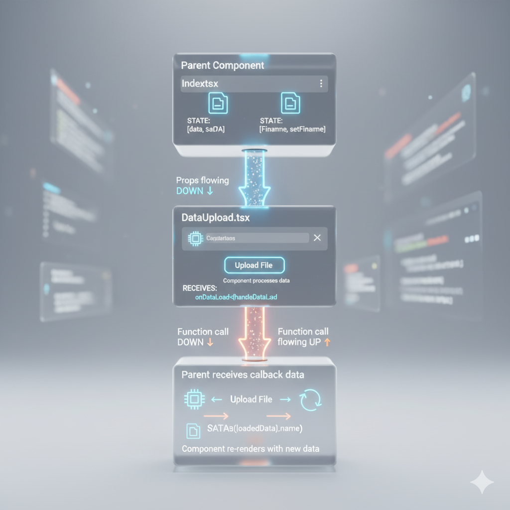
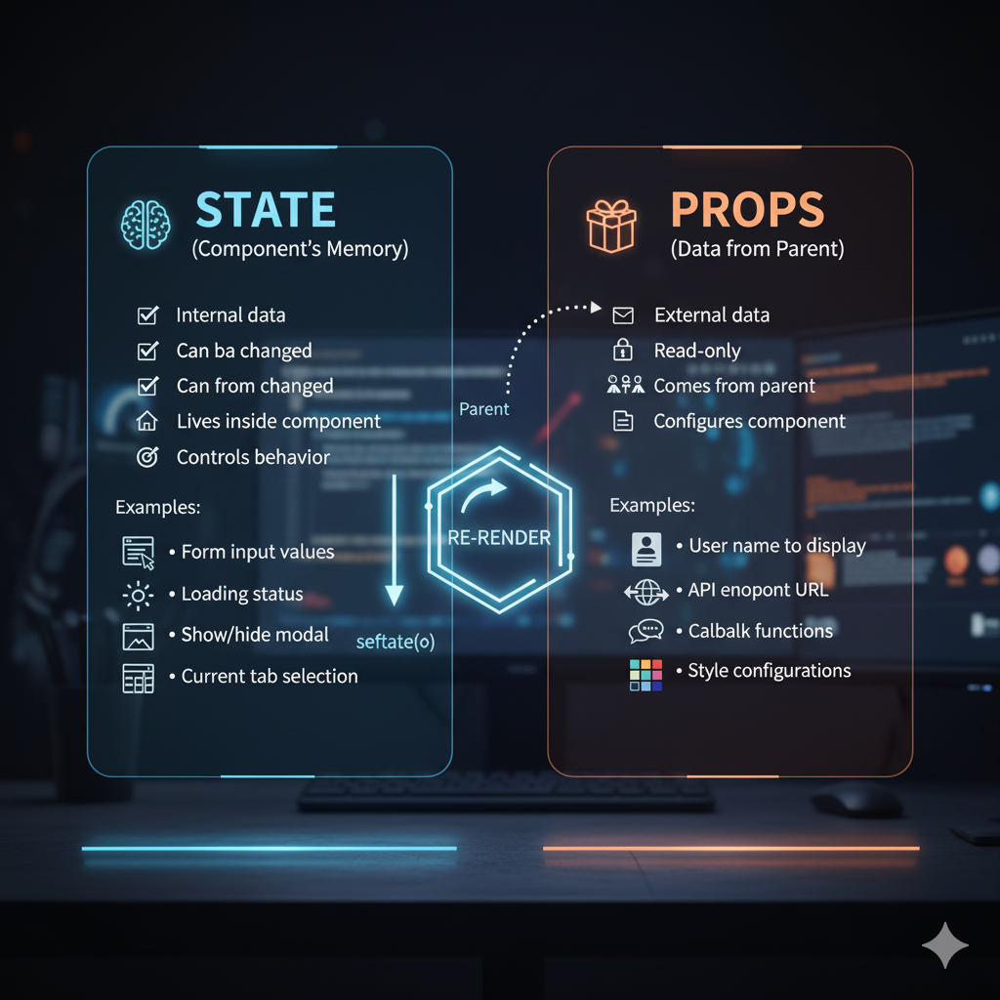
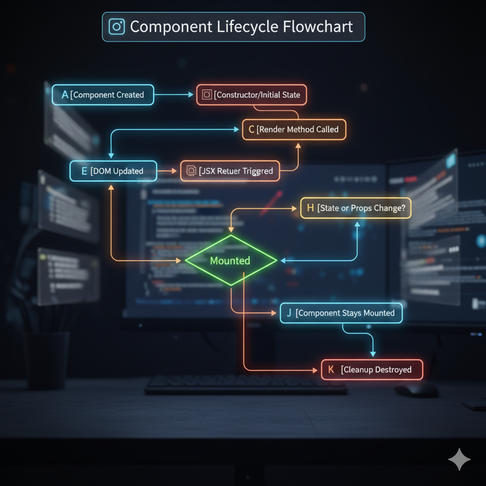

# 🚀 React Concepts Visual Guide

**A comprehensive visual guide to understanding React fundamentals**

---

*This guide is part of the 10-week React learning journey. Each concept builds on the previous one!* 🚀the "App" component, and inside it, you place smaller bricks like a "Dashboard" or "Data Upload" component.

### 📱 React Application Structure

```
┌─────────────────────────────────────────┐
│                App.tsx                   │  ← Root Component
│  ┌─────────────────────────────────────┐ │
│  │            Router Setup              │ │  
│  │  ┌─────────────────────────────────┐ │ │
│  │  │         Index.tsx               │ │ │  ← Main Page
│  │  │  ┌─────────────┐ ┌─────────────┐ │ │ │
│  │  │  │ DataUpload  │ │ Dashboard   │ │ │ │  ← Child Components
│  │  │  │             │ │             │ │ │ │
│  │  │  │ ┌─────────┐ │ │ ┌─────────┐ │ │ │ │
│  │  │  │ │ Button  │ │ │ │ Chart   │ │ │ │ │  ← Grandchild Components
│  │  │  │ │ Input   │ │ │ │ Table   │ │ │ │ │
│  │  │  │ └─────────┘ │ │ └─────────┘ │ │ │ │
│  │  │  └─────────────┘ └─────────────┘ │ │ │
│  │  └─────────────────────────────────┘ │ │
│  └─────────────────────────────────────┐ │
└─────────────────────────────────────────┘
```

> **� Key Concept:** Each component is independent and reusable, like LEGO bricks!

---

## 🔄 Data Flow Visualization

In React, data flows in **one direction**: from parent to child components.

*Illustration of how data flows between parent and child components in React*

### 📊 Props & State Flow
### Component Lifecycle

```
Parent Component (Index.tsx)
┌─────────────────────────────────────────┐
│  STATE: [data, setData] = useState([])   │
│  STATE: [fileName, setFileName] = ...    │
└─────────────┬───────────────────────────┘
              │ Props flowing DOWN ⬇️
              │ 
┌─────────────▼───────────────────────────┐
│        Child Component (DataUpload)      │
│                                         │
│  RECEIVES: onDataLoad={handleDataLoad}  │
│                                         │
│  ┌─────────────────────────────────┐    │
│  │ User uploads file 📁            │    │
│  │ Component processes data 🔄     │    │
│  │ Calls onDataLoad(data, name) 📤 │    │
│  └─────────────────────────────────┘    │
└─────────────┬───────────────────────────┘
              │ Function call flowing UP ⬆️
              │
┌─────────────▼───────────────────────────┐
│     Parent receives callback data       │
│                                         │
│  setData(loadedData) ← Updates state    │
│  setFileName(name)   ← Updates state    │
│                                         │
│  🔄 Component re-renders with new data  │
└─────────────────────────────────────────┘
```


---

## 🧠 State vs Props
### State Management Concepts

*Visual representation of how state works in React applications*

### Comparison Table

| Aspect | **State** 🏠 | **Props** 📨 |
|--------|-------------|--------------|
| **Ownership** | Internal to component | Passed from parent |
| **Mutability** | Can be changed (setState) | Read-only |
| **Purpose** | Component's memory | Configuration from parent |
| **Examples** | Form values, loading status | User name, callback functions |

### Visual Representation

<div align="center">

**STATE (Component's Memory)**
```
┌─────────────────────────────┐
│  📝 Internal data           │
│  🔄 Can be changed          │  
│  🏠 Lives inside component  │
│  🎯 Controls behavior       │
│                             │
│  Examples:                  │
│  • Form input values       │
│  • Loading status          │
│  • Show/hide modal        │
│  • Current tab selection   │
└─────────────────────────────┘
              │
              │ setState()
              ▼
        ┌──────────┐
        │ RE-RENDER │
        └──────────┘
```

**PROPS (Data from Parent)**
```
┌─────────────────────────────┐
│  📨 External data           │
│  🔒 Read-only               │
│  👨‍👩‍👧‍👦 Comes from parent      │
│  📋 Configures component    │
│                             │
│  Examples:                  │
│  • User name to display    │
│  • API endpoint URL        │
│  • Callback functions      │
│  • Style configurations    │
└─────────────────────────────┘
```

</div>

---

## 📱 Component Lifecycle

Every React component has a "lifecycle" - a journey from creation to destruction.



### Lifecycle Flowchart

```
    📱 COMPONENT LIFECYCLE JOURNEY

1. CREATION (MOUNTING)
   ┌─────────────────────┐
   │ Component Created   │
   └─────────┬───────────┘
             │
             ▼
   ┌─────────────────────┐
   │ Initial State Set   │
   └─────────┬───────────┘
             │
             ▼
   ┌─────────────────────┐
   │ First Render        │
   └─────────┬───────────┘
             │
             ▼
   ┌─────────────────────┐
   │ ✅ COMPONENT MOUNTED │
   └─────────┬───────────┘
             │
             ▼
2. UPDATES (LIVING)
   ┌─────────────────────┐
   │ Props/State Change? │
   └─────┬───────────┬───┘
         │ YES       │ NO
         ▼           ▼
   ┌─────────┐   ┌─────────┐
   │ Re-render│   │ Stay    │
   │ Component│   │ Mounted │
   └─────┬───┘   └─────────┘
         │           ▲
         └───────────┘
         
3. DESTRUCTION (UNMOUNTING)
   ┌─────────────────────┐
   │ Component Removed?  │
   └─────────┬───────────┘
             │ YES
             ▼
   ┌─────────────────────┐
   │ Cleanup Effects     │
   └─────────┬───────────┘
             │
             ▼
   ┌─────────────────────┐
   │ 💀 COMPONENT DEAD    │
   └─────────────────────┘
```

### 🎯 The Three Phases

1. **🎂 Birth (Mounting)**: Component is created and added to the DOM
2. **🌱 Growth (Updating)**: Component re-renders due to state/props changes  
3. **💀 Death (Unmounting)**: Component is removed from the DOM

---

## 👆 Event Handling Flow

### User Interaction to State Update

```
1. USER ACTION
   ┌─────────────────┐
   │  🖱️ User clicks   │
   │     button      │
   └─────────┬───────┘
             │
             ▼
2. EVENT HANDLER
   ┌─────────────────┐
   │ onClick={       │
   │   handleClick   │
   │ }               │
   └─────────┬───────┘
             │
             ▼
3. FUNCTION EXECUTION
   ┌─────────────────┐
   │ const handleClick│
   │ = () => {       │
   │   setCount(     │
   │     count + 1   │
   │   )             │
   │ }               │
   └─────────┬───────┘
             │
             ▼
4. STATE UPDATE
   ┌─────────────────┐
   │ React schedules │
   │ component       │
   │ re-render       │
   └─────────┬───────┘
             │
             ▼
5. RE-RENDER
   ┌─────────────────┐
   │ Component       │
   │ renders with    │
   │ new state       │
   └─────────────────┘
```

---

## 🧩 JSX Transformation

### What You Write vs What React Creates

<div align="center">

**📝 What You Write (JSX):**

</div>

```jsx
const WelcomeMessage = ({ name, age }) => {
  return (
    <div className="welcome">
      <h1>Hello, {name}!</h1>
      <p>You are {age} years old.</p>
      <button onClick={handleClick}>
        Click me
      </button>
    </div>
  );
};
```

<div align="center">

**🔄 What React Creates (JavaScript):**

</div>

```javascript
const WelcomeMessage = ({ name, age }) => {
  return React.createElement(
    "div",
    { className: "welcome" },
    React.createElement("h1", null, "Hello, ", name, "!"),
    React.createElement("p", null, "You are ", age, " years old."),
    React.createElement(
      "button", 
      { onClick: handleClick }, 
      "Click me"
    )
  );
};
```

> **� Behind the scenes:** JSX is just syntactic sugar for `React.createElement()` calls!

---

## �📊 File Structure Mental Model

### 🏗️ Project Organization

```
src/
├── 🏠 App.tsx ...................... Main house (root component)
├── 📄 main.tsx .................... Front door (entry point)  
├── 🎨 index.css ................... Paint & decorations (styles)
├── 📁 pages/
│   ├── 🏠 Index.tsx ............... Living room (main page)
│   └── 🚫 NotFound.tsx ............ Basement (error page)
├── 📁 components/
│   ├── 📤 DataUpload.tsx .......... Kitchen (data preparation)
│   ├── 📊 Dashboard.tsx ........... Office (data analysis)
│   ├── 📈 ChartSection.tsx ........ Gallery (visualizations)
│   └── 📁 ui/ .................... Toolshed (reusable tools)
│       ├── 🔘 button.tsx
│       ├── 📋 card.tsx  
│       └── 📊 chart.tsx
├── 📁 types/
│   └── 📝 data.ts ................. Blueprint (type definitions)
└── 📁 utils/
    └── 🧮 dataAnalysis.ts ......... Workshop (utility functions)
```

---

## 🪝 What Are React Hooks?

### 🎯 Simple Explanation

**Think of hooks like special powers for your React components!** 

Before hooks, only **class components** could have "memory" (state) and react to lifecycle events. **Function components** were just simple functions that took props and returned JSX - they couldn't remember anything or do anything special.

**Hooks changed everything!** Now function components can:
- 🧠 **Remember things** (useState)
- 👁️ **Watch for changes** (useEffect) 
- ⚡ **Perform optimizations** (useMemo, useCallback)
- 🔄 **Access React features** that were only available in class components

### 🏗️ The "Hook" Metaphor

```
🎣 FISHING ANALOGY

Imagine your component is a fisherman, and hooks are fishing hooks:

┌─────────────────────────────────────┐
│         🎣 Your Component           │
│                                     │
│  🪝 useState ────────── 🐟 State    │
│  🪝 useEffect ──────── 🐟 Side Effects │
│  🪝 useCallback ────── 🐟 Performance │
│  🪝 useMemo ────────── 🐟 Calculations │
│                                     │
│  Each hook "catches" a specific     │
│  React feature for your component! │
└─────────────────────────────────────┘
```

### 📋 Hook Rules (Very Important!)

**React hooks have two main rules:**

1. **🔝 Only call hooks at the top level**
   ```jsx
   ❌ DON'T DO THIS:
   function MyComponent() {
     if (someCondition) {
       const [count, setCount] = useState(0); // ❌ Inside condition
     }
   }
   
   ✅ DO THIS:
   function MyComponent() {
     const [count, setCount] = useState(0); // ✅ At top level
     
     if (someCondition) {
       // Other logic here
     }
   }
   ```

2. **⚛️ Only call hooks inside React functions**
   ```jsx
   ❌ DON'T DO THIS:
   function regularFunction() {
     const [count, setCount] = useState(0); // ❌ Not in React component
   }
   
   ✅ DO THIS:
   function MyComponent() {
     const [count, setCount] = useState(0); // ✅ Inside React component
   }
   ```

### 🎭 Before vs After Hooks

<div align="center">

**Before Hooks (Class Components):**
```jsx
class Counter extends React.Component {
  constructor(props) {
    super(props);
    this.state = { count: 0 }; // Complex setup
  }
  
  componentDidMount() {
    document.title = `Count: ${this.state.count}`;
  }
  
  componentDidUpdate() {
    document.title = `Count: ${this.state.count}`;
  }
  
  render() {
    return (
      <div>
        <p>Count: {this.state.count}</p>
        <button onClick={() => this.setState({count: this.state.count + 1})}>
          Click me
        </button>
      </div>
    );
  }
}
```

**After Hooks (Function Components):**
```jsx
function Counter() {
  const [count, setCount] = useState(0); // Simple!
  
  useEffect(() => {
    document.title = `Count: ${count}`;
  }); // Handles both mount and update!
  
  return (
    <div>
      <p>Count: {count}</p>
      <button onClick={() => setCount(count + 1)}>
        Click me
      </button>
    </div>
  );
}
```

</div>

### 🧰 Most Common Hooks

| Hook | Purpose | When to Use |
|------|---------|-------------|
| `useState` | Component memory | When you need to remember and change data |
| `useEffect` | Side effects | When you need to do something after render |
| `useCallback` | Memoize functions | When passing functions to child components |
| `useMemo` | Memoize values | When you have expensive calculations |
| `useContext` | Share data | When you need to avoid prop drilling |

### 💡 Why Hooks Are Amazing

1. **🎯 Simpler Code**: No more complex class syntax
2. **🔄 Reusable Logic**: Create custom hooks to share logic between components
3. **🧹 Cleaner Effects**: Group related logic together instead of splitting across lifecycle methods
4. **📦 Smaller Bundle**: Function components are more optimizable than classes
5. **🚀 Better Performance**: Easier for React to optimize

---

## 🪝 React Hooks Patterns

### Common Hooks Visualization

```javascript
// 1. STATE HOOK - Component Memory
const [count, setCount] = useState(0);
      ┌─────┐    ┌─────────┐
      │VALUE│    │FUNCTION │
      │     │    │TO UPDATE│  
      └─────┘    └─────────┘

// 2. EFFECT HOOK - Side Effects  
useEffect(() => {
  // Do something when component mounts/updates
  document.title = `Count: ${count}`;
  
  return () => {
    // Cleanup when component unmounts
    document.title = 'React App';
  };
}, [count]); // Dependencies array
   └─────┘
   When to run effect

// 3. CALLBACK HOOK - Performance
const handleClick = useCallback(() => {
  setCount(count + 1);
}, [count]);
   └─────┘
   Dependencies

// 4. MEMO HOOK - Expensive Calculations
const expensiveValue = useMemo(() => {
  return calculateSomethingExpensive(data);
}, [data]);
   └────┘
   Only recalculate when data changes
```

---

## 📱 Responsive Design Concept

### 📱💻🖥️ Mobile-First Breakpoints

```
┌─────────────────┐  ← Base styles (mobile)
│   📱 < 768px    │    sm: min-width 640px
│                 │    md: min-width 768px  
│  Stack content  │    lg: min-width 1024px
│   vertically    │    xl: min-width 1280px
└─────────────────┘

┌─────────────────────────────┐  ← Tablet (md:)
│       💻 768px - 1024px     │
│                             │
│    Side-by-side content     │
│      Grid: 2 columns        │
└─────────────────────────────┘

┌─────────────────────────────────────────┐  ← Desktop (lg:)
│           🖥️ > 1024px                   │
│                                         │
│        Multiple columns layout          │
│         Grid: 3-4 columns               │
└─────────────────────────────────────────┘
```

---

## 🎨 Styling with Tailwind CSS

### CSS-in-JS vs Utility Classes

<div align="center">

**Traditional CSS:**
```css
.my-button {
  background-color: blue;
  color: white;
  padding: 8px 16px;
  border-radius: 4px;
  border: none;
}
```

**Tailwind Utilities:**
```jsx
<button className="bg-blue-500 text-white px-4 py-2 rounded border-none">
```

**Design System Approach:**
```jsx
<button className="bg-primary text-primary-foreground px-4 py-2 rounded border-none">
                   ↑                    ↑
            Uses CSS variables    Maintains consistency
            from index.css       across entire app
```

</div>

---


## 🎓 Additional Resources

- [React Dev Tools Browser Extension](https://react.dev/learn/react-developer-tools)
- [Thinking in React Guide](https://react.dev/learn/thinking-in-react)
- [Interactive React Tutorial](https://react.dev/learn/tutorial-tic-tac-toe)

---

*This guide is part of the 10-week React learning journey. Each concept builds on the previous one!* 🚀

